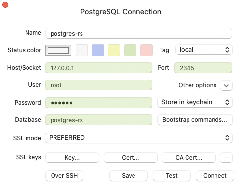

# Postgres Database with Rust Backend using SQLx

## Stack: [SQLx](https://github.com/launchbadge/sqlx)

### Database Setup

Use the Makefile commands to setup a Postgres database using Docker:

1. `make postgres` will run a new Docker container called *postgreSQLx*

    If you are using a database management tool like [TablePlus](https://tableplus.com), then you can connect to the newly created database container.

    To create the connection using this example, the name of the PostgreSQL database is *postgreSQLx*, the host/socket is localhost (127.0.0.1), the port is *2345* (this can be changed to 5432 which is the default port for PostgreSQL, but I already have a container at 5432 on my machine, so I changed it), the user is *root*, the password is *secret*, and the database is *postgreSQLx*.

    

    You can also access the PostgreSQL shell directly with:

    ```bash
    PGPASSWORD="password123" psql -U root -h localhost -p 2345 postgreSQLx
    ```

    We have not migrated the database yet or created any tables, so if you enter `\dt` to list the relations in the database, you should see **`Did not find any relations.`** printed. We will try again after migrating.

    To end off, once you are connected or able to view the database and its tables, you should see there are no tables yet. We will migrate the database to add the initial tables.

2. `make mup` will run a SQLx database migration to create the tables.

    Now refresh or check the database and you should see the newly created product table with the columns provided in **[migrations/0001_product_table.up.sql](migrations/0001_product_table.up.sql)**.

    Again, you can also check the database by accessing the PostgreSQL shell directly with:

    ```bash
    PGPASSWORD="secret" psql -U root -h localhost -p 2345 postgres-rs
    ```

    Then typing `\dt` to display a list of all the database relations.

    The result should look something like this table:

    | Schema | Name              | Type   | Owner
    | ------ | ----------------- | ------ | ------
    | public | _sqlx_migrations  | table  | root
    | public | product           | table  | root

    You can also check a specific table, for example the *product* table with:

    ```bash
    SELECT * FROM product;
    ```

    The output of the product table should have the columns provided in **[migrations/0001_product_table.up.sql](migrations/0001_product_table.up.sql)**, which should look something like this:

    | id | title | description | sku | quantity | price | sale_price

    |----|-------|-------------|-----|----------|-------|------------
